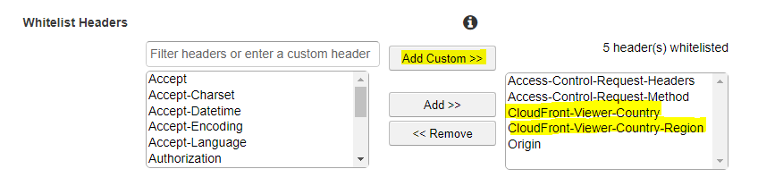

[](https://www.npmjs.com/package/@mdnx/express-cloudfront-gdpr)
[](https://www.npmjs.org/package/@mdnx/express-cloudfront-gdpr)

# Express Cloudfront GDPR & CCPA Middleware

This package provides a express middleware to detect if [GDPR](https://en.wikipedia.org/wiki/General_Data_Protection_Regulation) or [CCPA](https://en.wikipedia.org/wiki/California_Consumer_Privacy_Act) applies for a user by inspecting aws cloudfront headers.

## Installation / Use in TypeScript projects

```bash
npm install @mdnx/express-cloudfront-gdpr --save
```

## Usage

To create a response header with gdpr flag:

```typescript
import express from 'express';
import { gdprHeaderMiddleware } from '@mdnx/express-cloudfront-gdpr';

const app = express();
app.use(gdprHeaderMiddleware({
  headerName: 'X-Gdpr-Applies',
  headerTrueValue: '1',
  headerFalseValue: '0',
}));
```

To create a response header with ccpa flag:

```typescript
import express from 'express';
import { ccpaHeaderMiddleware } from '@mdnx/express-cloudfront-gdpr';

const app = express();
app.use(ccpaHeaderMiddleware({
  headerName: 'X-Ccpa-Applies',
  headerTrueValue: '1',
  headerFalseValue: '0',
}));
```

## Cloudfront Setup

In the cloudfront configuration you need to whitelist the following headers to get passed to the express server:

- "CloudFront-Viewer-Country"
- "CloudFront-Viewer-Country-Region"


